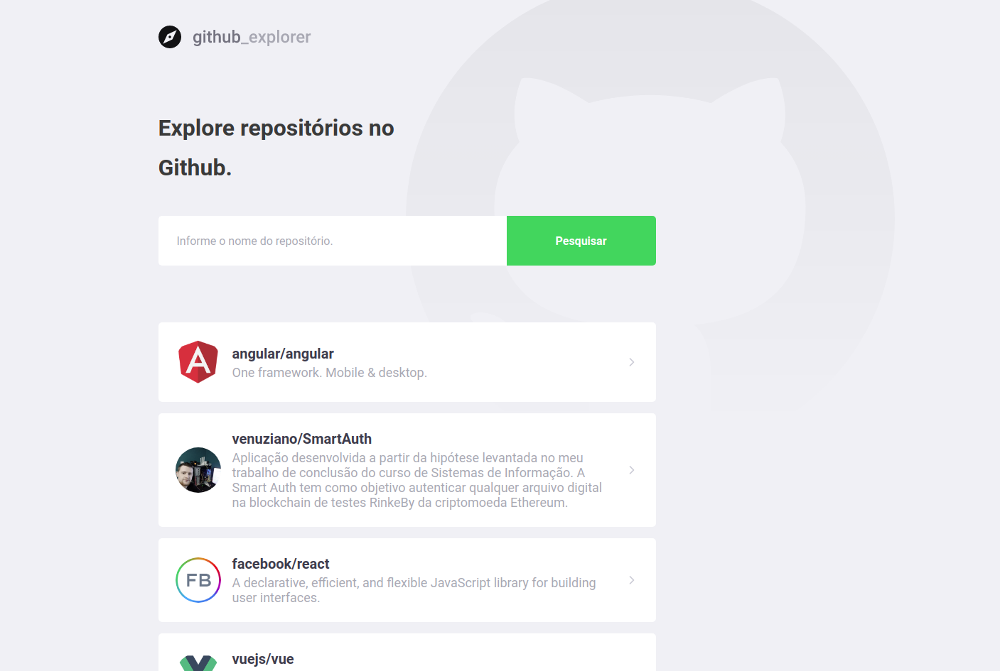
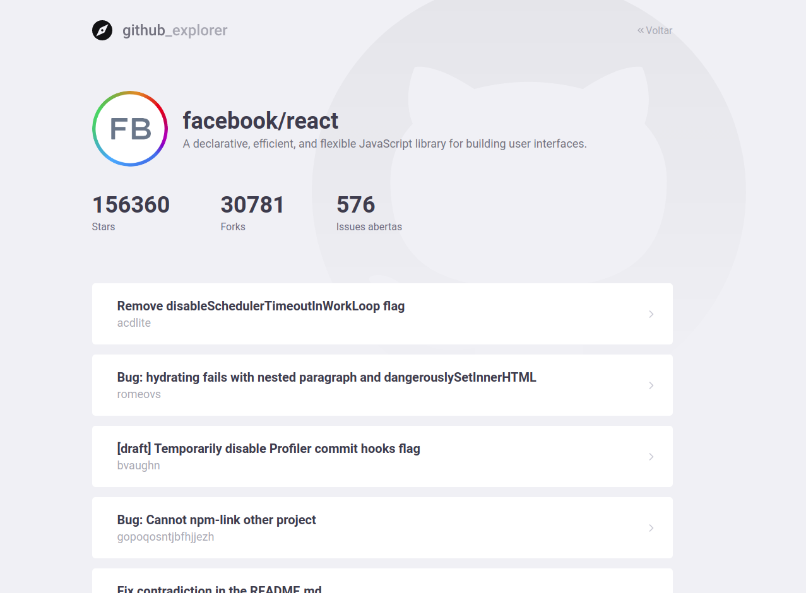

<h1 align="center">Github Explorer</h1>

Aplicativo <strong>SPA</strong> para busca de repositórios no Github.

<h4 align="center"> 
  :heavy_check_mark:  Github Explorer 🚀 Finalizado  :heavy_check_mark:
</h4>

    
  
  

 Sobre o projeto
=================

 Procure qualquer repositório através deste explorer. O repositório é encontrado informando o nome da conta/nome do repositório. Exemplo: facebook/react 

 Demonstração de quando um repositório é selecionado:
=================

  

<h2><g-emoji class="g-emoji" alias="hammer_and_wrench" fallback-src="https://github.githubassets.com/images/icons/emoji/unicode/1f6e0.png">🛠</g-emoji> Tecnologias </h2>

<ul>
  <li><strong><a>TypeScript</a></strong></li>
  <li><strong><a>ReactJS</a></strong></li>
  <li><strong><a>Styled-Components</a></strong></li>
  <li><strong><a>API Github</a></strong></li>
</ul>

<h2><a fallback-src="https://github.githubassets.com/images/icons/emoji/unicode/1f9b8.png"></g-emoji> Autor</h2>

<b>Rafael Rodrigues</b>

 

<h2><a fallback-src="https://github.githubassets.com/images/icons/emoji/unicode/1f4dd.png"></g-emoji> Licença</h2>

Este projeto está sobe a licença <a href="https://github.com/venuziano/Proffys/blob/master/LICENSE">MIT</a>.

